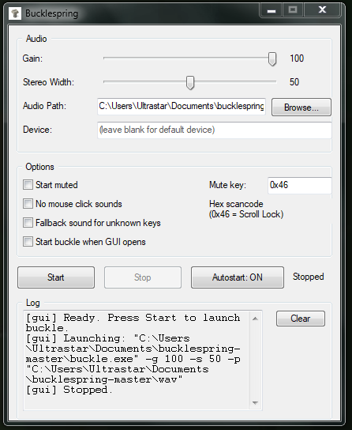

# buckle-gui

> A native Win32 GUI launcher for [Bucklespring](https://github.com/zevv/bucklespring) — the IBM Model M keyboard sound simulator.


---

## Why this exists

Bucklespring is a brilliant tool, but it lives entirely in the terminal. This GUI wraps it with zero overhead — **no Electron, no Python, no runtimes** — just native Win32 C code that weighs less than 1MB and idles at 0% CPU.

---

## Screenshot



---

## Features

- **Real-time log** — pipe captures buckle's stdout/stderr directly into the UI
- **Sliders** for gain and stereo width
- **System tray** — minimize to tray, right-click menu, double-click to restore
- **Autostart toggle** — one click writes/removes the Windows Run registry key
- **Start on launch** — optionally launch buckle automatically when the GUI opens
- **Audio folder browser** — no manual path typing required
- **Settings persistence** — all options saved to `buckle-gui.ini` automatically
- **Input validation** — mute key format checked before launch, paths properly escaped
- **DPI aware** — sharp on 125%/150% scaling (Windows 7+)

---

## Requirements

Place all of these in the same folder:

```
buckle-gui.exe
buckle.exe
ALURE32.dll
libopenal-1.dll
wav/
```

---

## Quick start

1. Run `buckle-gui.exe`
2. Set **Audio Path** to the folder containing the `.wav` files
3. Click **Start**

That's it. Settings are saved automatically on close.

---

## Options reference

| Option | Description |
|--------|-------------|
| Gain | Playback volume (0–100) |
| Stereo Width | Stereo field width (0 = mono, 100 = full) |
| Audio Path | Folder containing the `.wav` sound files |
| Device | OpenAL audio device (blank = system default) |
| Start muted | Launch buckle in muted state |
| No mouse click sounds | Disable sounds on mouse button clicks |
| Fallback sound | Play a generic sound for unrecognized keys |
| Start buckle when GUI opens | Auto-launch buckle on every GUI start |
| Mute key | Hex scancode to toggle mute (default `0x46` = Scroll Lock) |

### Mute toggle

Press the mute key **twice within 2 seconds** to toggle mute. Default: Scroll Lock. Configurable in Options.

### System tray

- **Close (X)** → exits the application
- **Minimize** → sends to taskbar
- **Right-click tray icon** → Show/Hide, Toggle Mute, Stop Buckle, Exit
- **Double-click tray icon** → restore window

---

## Building from source

Requires [MSYS2](https://www.msys2.org/) with the MinGW-w64 toolchain.

```bash
# Install dependencies (first time only)
pacman -S mingw-w64-x86_64-gcc mingw-w64-x86_64-binutils

# Clone and build
git clone https://github.com/zinzk714-art/bucklespring-gui
cd bucklespring-gui

windres -O coff src/buckle-gui.rc -o src/buckle-gui.res
gcc -O2 -mwindows -o bin/buckle-gui.exe src/buckle-gui.c src/buckle-gui.res \
    -luser32 -lgdi32 -lshell32 -lcomctl32 -lole32
```

No additional libraries required beyond Windows system DLLs.

---

## Technical notes

- Single `.c` file, ~950 lines, no external dependencies
- Pipe + dedicated reader thread captures buckle output asynchronously — UI never blocks
- `PostMessageW` used for thread-safe log updates
- Shutdown sequence: pipe closed before thread join — guaranteed instant exit
- Registry path properly escaped via `CommandLineToArgvW`-compliant escaping
- `buckle-gui.manifest` enables DPI awareness and Common Controls v6

---

## Project structure

```
bucklespring-gui/
├── src/
│   ├── buckle-gui.c        — full source, single file
│   ├── buckle-gui.rc       — icon, manifest, version info
│   └── buckle-gui.manifest — DPI aware + Common Controls v6
├── bin/
│   └── buckle-gui.exe      — precompiled binary
├── img/
│   └── preview.PNG         — screenshot
├── wav/                    — audio files (from original bucklespring)
├── LICENSE
└── README.md
```

---

## Credits

- [Bucklespring](https://github.com/zevv/bucklespring) by [zevv](https://github.com/zevv) — the original tool this GUI wraps, licensed under its own terms
- GUI by [zinzk714-art](https://github.com/zinzk714-art)
